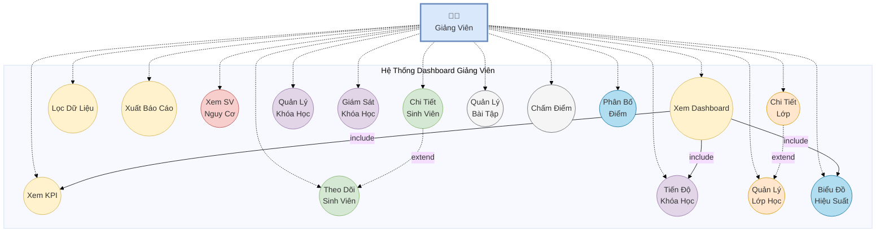

# Sơ Đồ Use Case - Dashboard Giảng Viên

## Cách xem sơ đồ:
1. Copy code Mermaid bên dưới
2. Truy cập: https://mermaid.live/
3. Paste code vào và xem sơ đồ
4. Có thể export ra PNG, SVG, hoặc PDF

## Code Mermaid:

```mermaid
graph TB
    %% Actor
    GV[👨‍🏫 Giảng Viên]
    
    %% System Boundary
    subgraph Dashboard["🖥️ Hệ Thống Dashboard Giảng Viên"]
        
        %% Dashboard & Overview
        subgraph DashboardGroup["📊 Dashboard & Tổng Quan"]
            UC1[Xem Dashboard<br/>Tổng Quan]
            UC2[Xem Chỉ Số KPI]
            UC3[Lọc Dữ Liệu<br/>Khóa học, Lớp, Mức độ]
            UC4[Xuất Báo Cáo]
            UC5[Làm Mới Dữ Liệu]
        end
        
        %% Student Management
        subgraph StudentGroup["👥 Quản Lý Sinh Viên"]
            UC6[Theo Dõi Sinh Viên]
            UC7[Xem Sinh Viên<br/>Có Nguy Cơ ⚠️]
            UC8[Xem Chi Tiết<br/>Sinh Viên]
            UC9[Xem Danh Sách<br/>Sinh Viên Theo Lớp]
        end
        
        %% Course Management
        subgraph CourseGroup["📚 Quản Lý Khóa Học"]
            UC10[Quản Lý Khóa Học]
            UC11[Xem Tiến Độ<br/>Khóa Học]
            UC12[Giám Sát Khóa Học]
            UC13[Xem Chi Tiết<br/>Các Lớp Trong Khóa]
        end
        
        %% Class Management
        subgraph ClassGroup["🏫 Quản Lý Lớp Học"]
            UC14[Quản Lý Lớp Học]
            UC15[Xem Chi Tiết Lớp]
            UC16[Xem Tiến Độ Lớp]
        end
        
        %% Assignment Management
        subgraph AssignmentGroup["📝 Quản Lý Bài Tập"]
            UC17[Quản Lý Bài Tập]
            UC18[Chấm Điểm Bài Tập]
            UC19[Xem Thống Kê<br/>Bài Tập]
        end
        
        %% Analytics & Reports
        subgraph AnalyticsGroup["📈 Phân Tích & Báo Cáo"]
            UC20[Xem Biểu Đồ<br/>Hiệu Suất]
            UC21[Xem Phân Bố Điểm]
            UC22[Xem Thông Báo]
        end
    end
    
    %% Associations - Actor to Use Cases
    GV --> UC1
    GV --> UC2
    GV --> UC3
    GV --> UC4
    GV --> UC5
    GV --> UC6
    GV --> UC7
    GV --> UC8
    GV --> UC9
    GV --> UC10
    GV --> UC11
    GV --> UC12
    GV --> UC13
    GV --> UC14
    GV --> UC15
    GV --> UC16
    GV --> UC17
    GV --> UC18
    GV --> UC19
    GV --> UC20
    GV --> UC21
    GV --> UC22
    
    %% Include Relationships
    UC1 -.->|include| UC2
    UC1 -.->|include| UC11
    UC1 -.->|include| UC12
    UC1 -.->|include| UC20
    UC1 -.->|include| UC21
    
    %% Extend Relationships
    UC8 -.->|extend| UC6
    UC9 -.->|extend| UC6
    UC13 -.->|extend| UC10
    UC15 -.->|extend| UC14
    UC16 -.->|extend| UC14
    UC19 -.->|extend| UC17
    
    %% Styling
    classDef actorStyle fill:#dae8fc,stroke:#6c8ebf,stroke-width:3px
    classDef dashboardStyle fill:#fff2cc,stroke:#d6b656,stroke-width:2px
    classDef studentStyle fill:#d5e8d4,stroke:#82b366,stroke-width:2px
    classDef courseStyle fill:#e1d5e7,stroke:#9673a6,stroke-width:2px
    classDef classStyle fill:#ffe6cc,stroke:#d79b00,stroke-width:2px
    classDef assignmentStyle fill:#f5f5f5,stroke:#666666,stroke-width:2px
    classDef analyticsStyle fill:#b1ddf0,stroke:#10739e,stroke-width:2px
    classDef dangerStyle fill:#f8cecc,stroke:#b85450,stroke-width:2px
    
    class GV actorStyle
    class UC1,UC2,UC3,UC4,UC5 dashboardStyle
    class UC6,UC8,UC9 studentStyle
    class UC7 dangerStyle
    class UC10,UC11,UC12,UC13 courseStyle
    class UC14,UC15,UC16 classStyle
    class UC17,UC18,UC19 assignmentStyle
    class UC20,UC21,UC22 analyticsStyle
```

## Sơ Đồ Use Case Chi Tiết (Dạng UML Chuẩn)

## Danh Sách Use Cases Chi Tiết

### 📊 Dashboard & Tổng Quan
1. **UC1: Xem Dashboard Tổng Quan**
   - Hiển thị tổng quan về tất cả các chỉ số quan trọng
   - Include: UC2, UC9, UC15

2. **UC2: Xem Chỉ Số KPI**
   - Tổng sinh viên
   - Khóa học đang diễn ra
   - Tỷ lệ hoàn thành trung bình
   - Sinh viên có nguy cơ
   - Xem chi tiết từng KPI (modal)

3. **UC3: Lọc Dữ Liệu**
   - Lọc theo khóa học
   - Lọc theo lớp
   - Lọc theo mức độ hiệu suất
   - Lọc theo trạng thái

4. **UC4: Xuất Báo Cáo**
   - Xuất báo cáo tổng quan
   - Xuất theo định dạng (PDF, Excel)

5. **UC5: Làm Mới Dữ Liệu**
   - Cập nhật dữ liệu mới nhất

### 👥 Quản Lý Sinh Viên
6. **UC6: Theo Dõi Sinh Viên**
   - Xem danh sách tất cả sinh viên
   - Xem tiến độ học tập

7. **UC7: Xem Sinh Viên Có Nguy Cơ** ⚠️
   - Danh sách sinh viên có nguy cơ
   - Xem các môn học có vấn đề
   - Điểm thấp / Chậm tiến độ

8. **UC8: Xem Chi Tiết Sinh Viên**
   - Thông tin cá nhân
   - Điểm trung bình
   - Tỷ lệ hoàn thành
   - Các môn học đang theo học

9. **UC9: Xem Danh Sách Sinh Viên Theo Lớp**
   - Lọc sinh viên theo lớp cụ thể

### 📚 Quản Lý Khóa Học
10. **UC10: Quản Lý Khóa Học**
    - Xem danh sách khóa học
    - Thông tin khóa học

11. **UC11: Xem Tiến Độ Khóa Học**
    - Tiến độ trung bình
    - Số sinh viên
    - Điểm trung bình

12. **UC12: Giám Sát Khóa Học**
    - Theo dõi hoạt động khóa học
    - Cảnh báo vấn đề

13. **UC13: Xem Chi Tiết Các Lớp Trong Khóa**
    - Danh sách các lớp
    - Thống kê từng lớp

### 🏫 Quản Lý Lớp Học
14. **UC14: Quản Lý Lớp Học**
    - Xem danh sách lớp
    - Thông tin lớp

15. **UC15: Xem Chi Tiết Lớp**
    - Danh sách sinh viên trong lớp
    - Thống kê lớp

16. **UC16: Xem Tiến Độ Lớp**
    - Tiến độ trung bình lớp
    - So sánh giữa các lớp

### 📝 Quản Lý Bài Tập
17. **UC17: Quản Lý Bài Tập**
    - Tạo bài tập mới
    - Xem danh sách bài tập

18. **UC18: Chấm Điểm Bài Tập**
    - Chấm điểm sinh viên
    - Nhận xét

19. **UC19: Xem Thống Kê Bài Tập**
    - Tỷ lệ hoàn thành
    - Điểm trung bình

### 📈 Phân Tích & Báo Cáo
20. **UC20: Xem Biểu Đồ Hiệu Suất**
    - Biểu đồ xu hướng
    - So sánh theo thời gian

21. **UC21: Xem Phân Bố Điểm**
    - Phân bố điểm số
    - Thống kê theo mức độ

22. **UC22: Xem Thông Báo**
    - Thông báo quan trọng
    - Cảnh báo hệ thống

## Mối Quan Hệ

### Include (Bao gồm)
- Dashboard → KPI
- Dashboard → Tiến độ khóa học
- Dashboard → Biểu đồ hiệu suất

### Extend (Mở rộng)
- Chi tiết sinh viên ← Theo dõi sinh viên
- Chi tiết lớp ← Quản lý lớp
- Chi tiết các lớp ← Quản lý khóa học

## Chú Thích Màu Sắc
- 🟡 Vàng: Dashboard & Tổng quan
- 🟢 Xanh lá: Quản lý Sinh viên
- 🔴 Đỏ: Cảnh báo (Sinh viên nguy cơ)
- 🟣 Tím: Quản lý Khóa học
- 🟠 Cam: Quản lý Lớp học
- ⚫ Xám: Quản lý Bài tập
- 🔵 Xanh dương: Phân tích & Báo cáo
